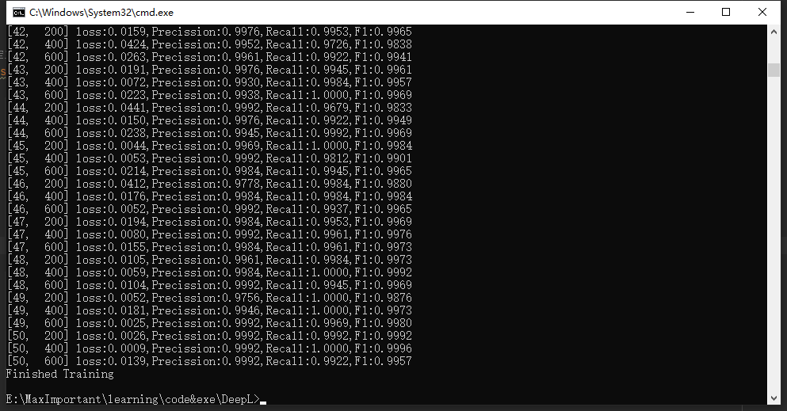

# ResNet50 in Bitmoji

--
该代码由ResNet50构成，使用了torchvision.models.resnet50

--
## Requirements
My code works with the following environment.
* `python=3.8.8`
* `pytorch=1.13.0+cu116`
* tqdm
* numpy
* pandas
* ...

## Dataset
using [`Bitmojidata`](https://drive.google.com/file/d/1atMwmdOJe_fqG8Tyg5eqxZ-iDyPxDJOR/view?usp=sharing), Put all files under `./`

## Result
Here are My results of Train:

